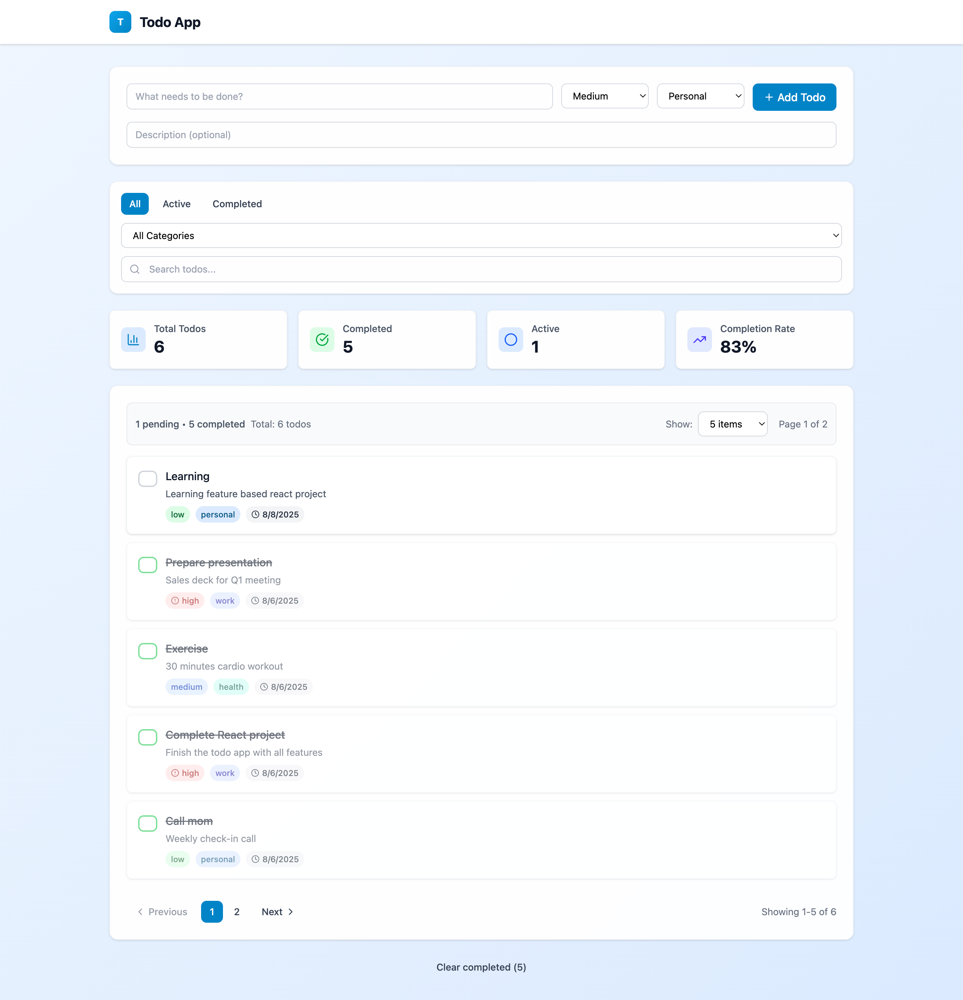

# React Todo Feature Based

Create a feature-based React application for managing todos with Bun, TypeScript, Tailwind CSS, and Vite. The project should be structured to allow for easy scalability and maintainability, with a focus on modularity and reusability.



## 🛠 Tech Stack

### **Core Technologies**

- **⚛️ React 19.1.0**: Latest React with concurrent features
- **📘 TypeScript**: Full type safety and IntelliSense
- **🎨 Tailwind CSS v4.1.11**: Utility-first CSS framework
- **⚡ Vite 7.0.4**: Lightning-fast build tool
- **🟡 Bun 1.0.4**: Ultra-fast JavaScript runtime and package manager

### **State Management**

- **🐻 Zustand**: Lightweight state management
- **💾 Zustand Persist**: LocalStorage persistence middleware

### **Development Tools**

- **🔧 ESLint**: Code linting and formatting
- **🏗️ TypeScript Config**: Strict type checking
- **📦 Path Mapping**: Clean import aliases
- **🔄 Hot Reload**: Instant development feedback

### **UI & UX**

- **🎯 Lucide React**: Beautiful icon library
- **🎨 Custom Design System**: Consistent UI components
- **📱 Responsive Design**: Mobile-first approach
- **✨ Smooth Animations**: CSS transitions and hover effects

## 🚀 Quick Start

### **Prerequisites**

- **Bun** (latest version) - [Install Bun](https://bun.sh)
- **Node.js** 18+ (for compatibility)
- **Git** for version control

### **Installation**

```bash
# Clone the repository
git clone https://github.com/jutionck/react-todo-feature-based.git

# Navigate to project directory
cd react-todo-feature-based

# Install dependencies
bun install

# Start development server
bun run dev

# Open your browser and navigate to
# http://localhost:5173
```

### **Available Scripts**

```bash
# Development
bun run dev          # Start development server

# Building
bun run build        # Build for production
bun run preview      # Preview production build

# Code Quality
bun run lint         # Run ESLint
bun run type-check   # Run TypeScript compiler
```

### **Project Setup**

The project uses **Bun** as the runtime and package manager for optimal performance:

- ⚡ **50x faster** than npm for package installation
- 🚀 **Built-in bundler** and test runner
- 🔧 **TypeScript support** out of the box
- 📦 **Better dependency resolution**

## Structure Project

```
react-todo-feature-based/
├── src/
│   ├── features/
│   │   ├── app/
│   │   │   ├── hooks/
│   │   │   │   └── useAppState.ts
│   │   │   └── index.ts
│   │   │
│   │   ├── todos/
│   │   │   ├── api/
│   │   │   │   ├── todoApi.ts
│   │   │   │   ├── todoApi.mock.ts
│   │   │   │   └── todoApi.types.ts
│   │   │   ├── components/
│   │   │   │   ├── TodoList.tsx
│   │   │   │   ├── TodoItem.tsx
│   │   │   │   ├── TodoForm.tsx
│   │   │   │   ├── TodoStats.tsx
│   │   │   │   ├── ClearCompletedButton.tsx
│   │   │   │   └── EditTodoModal.tsx
│   │   │   ├── hooks/
│   │   │   │   ├── useTodos.ts
│   │   │   │   ├── useCreateTodo.ts
│   │   │   │   ├── useUpdateTodo.ts
│   │   │   │   ├── useDeleteTodo.ts
│   │   │   │   ├── useToggleTodo.ts
│   │   │   │   ├── useTodoFilters.ts
│   │   │   │   ├── useTodoStats.ts
│   │   │   │   └── useTodoOperations.ts
│   │   │   ├── store/
│   │   │   │   └── todoStore.ts
│   │   │   ├── types/
│   │   │   │   └── todo.types.ts
│   │   │   ├── utils/
│   │   │   │   └── todoHelpers.ts
│   │   │   └── index.ts
│   │   │
│   │   ├── filters/
│   │   │   ├── components/
│   │   │   │   ├── FilterBar.tsx
│   │   │   │   └── SearchBar.tsx
│   │   │   ├── hooks/
│   │   │   │   └── useFilters.ts
│   │   │   ├── store/
│   │   │   │   └── filterStore.ts
│   │   │   ├── types/
│   │   │   │   └── filter.types.ts
│   │   │   └── index.ts
│   │   │
│   │   └── statistics/
│   │       ├── components/
│   │       │   ├── StatsOverview.tsx
│   │       │   └── StatCard.tsx
│   │       ├── hooks/
│   │       │   └── useStatistics.ts
│   │       └── index.ts
│   │
│   ├── shared/
│   │   ├── api/
│   │   │   ├── client.ts
│   │   │   ├── config.ts
│   │   │   └── interceptors.ts
│   │   ├── components/
│   │   │   ├── ui/
│   │   │   │   ├── Button.tsx
│   │   │   │   ├── Input.tsx
│   │   │   │   ├── Select.tsx
│   │   │   │   ├── Modal.tsx
│   │   │   │   ├── Badge.tsx
│   │   │   │   ├── EmptyState.tsx
│   │   │   │   ├── PaginationControls.tsx
│   │   │   │   └── ItemsPerPageSelector.tsx
│   │   │   └── layout/
│   │   │       ├── Header.tsx
│   │   │       └── Container.tsx
│   │   ├── hooks/
│   │   │   ├── useApiError.ts
│   │   │   ├── useLocalStorage.ts
│   │   │   ├── useDebounce.ts
│   │   │   └── usePagination.ts
│   │   ├── utils/
│   │   │   └── cn.ts
│   │   └── types/
│   │       └── common.types.ts
│   │
│   ├── app/
│   │   ├── App.tsx
│   │   ├── App.css
│   │   └── main.tsx
│   │
│   ├── index.css
│   └── vite-env.d.ts
│
├── .gitignore
├── bun.lockb
├── eslint.config.js
├── index.html
├── package.json
├── tailwind.config.js
├── tsconfig.app.json
├── tsconfig.json
├── tsconfig.node.json
├── vite.config.ts
└── README.md
```

## Features Implemented

### 🎯 **Core Features**

- ✅ **Todo Management**: Create, read, update, delete todos
- ✅ **Todo Status**: Toggle between completed/pending
- ✅ **Rich Todo Data**: Title, description, priority, category, due date
- ✅ **Persistent Storage**: LocalStorage with Zustand persist middleware

### 🔍 **Filtering & Search**

- ✅ **Status Filter**: All, Active, Completed todos
- ✅ **Category Filter**: Personal, Work, Shopping, Health
- ✅ **Search**: Real-time search in title and description
- ✅ **Combined Filters**: Multiple filters work together

### 📄 **Pagination**

- ✅ **Items Per Page**: 5, 10, 20, or Show All options
- ✅ **Smart Pagination**: Previous/Next with page numbers
- ✅ **Pagination Info**: Current page and total items display
- ✅ **Responsive Design**: Works on all screen sizes

### 📊 **Statistics & Analytics**

- ✅ **Todo Stats**: Pending, completed, and total counts
- ✅ **Completion Rate**: Visual progress indicators
- ✅ **Real-time Updates**: Stats update with filter changes

### 🎨 **UI/UX Features**

- ✅ **Responsive Design**: Mobile-first approach
- ✅ **Consistent Design System**: Shared UI components
- ✅ **Smooth Animations**: Transitions and hover effects
- ✅ **Empty States**: Helpful messages when no data
- ✅ **Loading States**: Better user experience

### 🛠 **Technical Features**

- ✅ **TypeScript**: Full type safety
- ✅ **Feature-Based Architecture**: Modular and scalable
- ✅ **Custom Hooks**: Reusable business logic
- ✅ **State Management**: Zustand for global state
- ✅ **Component Library**: Shared UI components
- ✅ **Clean Code**: Following best practices

## Key Components

### 📦 **New Components After Refactoring**

#### **App Level**

- `useAppState`: Central hook for all app-level state management

#### **Todo Feature**

- `TodoStats`: Statistics display component
- `ClearCompletedButton`: Dedicated clear completed button
- `useTodoFilters`: Centralized filtering logic
- `useTodoStats`: Statistics calculation hook
- `useTodoOperations`: Todo operations encapsulation

#### **Shared Components**

- `EmptyState`: Reusable empty state component
- `PaginationControls`: Complete pagination UI
- `ItemsPerPageSelector`: Items per page dropdown

#### **Filter Feature**

- `filterStore`: Zustand store for filter state
- Enhanced `FilterBar`: Using shared UI components

## Architecture Highlights

### 🏗 **Clean Architecture**

- **Feature-based structure**: Each feature is self-contained
- **Shared components**: Reusable UI elements
- **Custom hooks**: Business logic separation
- **Type safety**: Full TypeScript coverage

### 🔄 **State Management**

- **Zustand stores**: Lightweight and performant
- **Persistent state**: LocalStorage integration
- **Reactive updates**: Real-time UI updates

### 🎯 **Best Practices**

- **Single Responsibility**: Each component/hook has one job
- **DRY Principle**: No code duplication
- **Composition**: Building complex UIs from simple parts
- **Testability**: Easy to unit test individual pieces

## 📋 Data Structure

### **Todo Interface**

```typescript
interface Todo {
  id: string; // Unique identifier
  title: string; // Todo title
  description?: string; // Optional description
  completed: boolean; // Completion status
  priority: 'low' | 'medium' | 'high'; // Priority level
  category: 'personal' | 'work' | 'shopping' | 'health'; // Category
  createdAt: Date; // Creation timestamp
  updatedAt: Date; // Last update timestamp
  dueDate?: Date; // Optional due date
}
```

### **Filter State**

```typescript
interface FilterState {
  filter: 'all' | 'active' | 'completed'; // Status filter
  categoryFilter: 'all' | 'personal' | 'work' | 'shopping' | 'health'; // Category filter
  searchTerm: string; // Search query
}
```

## 🏗 Project Architecture

### **Feature-Based Structure**

Each feature is completely self-contained with:

- **Components**: UI components specific to the feature
- **Hooks**: Business logic and state management
- **Types**: TypeScript interfaces and types
- **Utils**: Helper functions and utilities
- **Store**: Zustand store for global state
- **API**: Data fetching and API integration

### **Dependency Flow**

```
App Level (useAppState)
    ↓
Feature Level (useTodoOperations, useFilters)
    ↓
Shared Level (usePagination, Button, Input)
```

### **State Management Pattern**

- **Global State**: Zustand stores for cross-component data
- **Local State**: React useState for component-specific state
- **Derived State**: useMemo for computed values
- **Side Effects**: useEffect for external interactions

## 🧪 Testing Strategy

### **Unit Testing**

- **Custom Hooks**: Test business logic in isolation
- **Components**: Test UI behavior and interactions
- **Utils**: Test helper functions and calculations
- **Stores**: Test state management logic

### **Integration Testing**

- **Feature Flow**: Test complete user workflows
- **Filter Combinations**: Test multiple filters together
- **Pagination**: Test pagination with different data sets

### **E2E Testing**

- **User Journeys**: Complete todo management workflows
- **Cross-browser**: Ensure compatibility across browsers
- **Responsive**: Test on different screen sizes

## 🚀 Deployment

### **Build Process**

```bash
# Build for production
bun run build

# Preview build locally
bun run preview

# Build artifacts in dist/ directory
```

### **Environment Variables**

```env
# API Configuration (if using external API)
VITE_API_BASE_URL=https://api.example.com
VITE_API_KEY=your-api-key

# Feature Flags
VITE_ENABLE_ANALYTICS=true
VITE_ENABLE_DEBUG=false
```

### **Production Optimizations**

- **Code Splitting**: Automatic route-based splitting
- **Tree Shaking**: Remove unused code
- **Asset Optimization**: Minified CSS and JS
- **Gzip Compression**: Smaller bundle sizes

## 🤝 Contributing

### **Development Workflow**

1. **Fork** the repository
2. **Create** a feature branch (`git checkout -b feature/amazing-feature`)
3. **Commit** your changes (`git commit -m 'Add amazing feature'`)
4. **Push** to the branch (`git push origin feature/amazing-feature`)
5. **Open** a Pull Request

### **Code Standards**

- **TypeScript**: Strict mode enabled
- **ESLint**: Follow configured rules
- **Prettier**: Consistent code formatting
- **Conventional Commits**: Clear commit messages

---

## 📄 License

This project is licensed under the MIT License - see the [LICENSE](LICENSE) file for details.

## 👨‍💻 Author

**Juti Noor Cahyo**

- GitHub: [@jutionck](https://github.com/jutionck)
- LinkedIn: [Jution Candra Kirana](https://linkedin.com/in/jutionck)

---

## ⭐ Show Your Support

Give a ⭐ if this project helped you learn about modern React development patterns!
